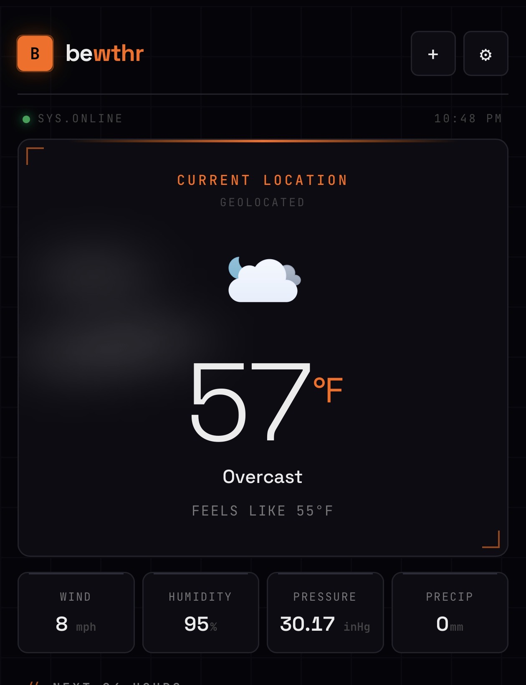
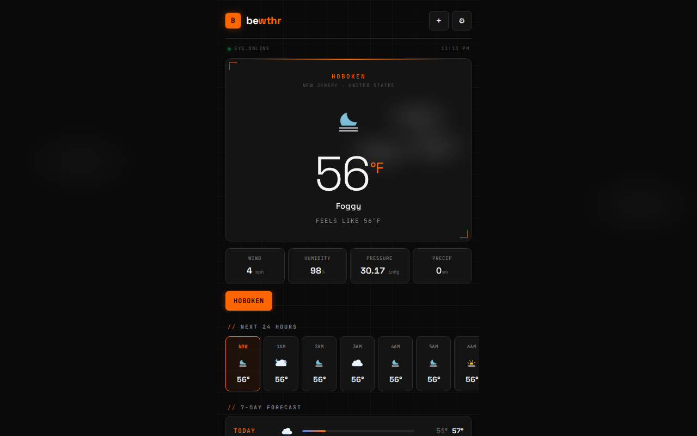
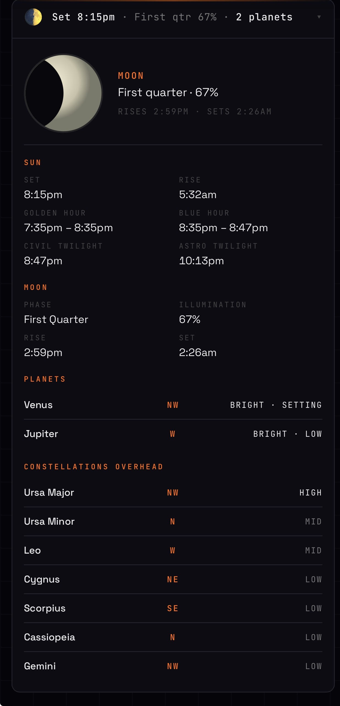
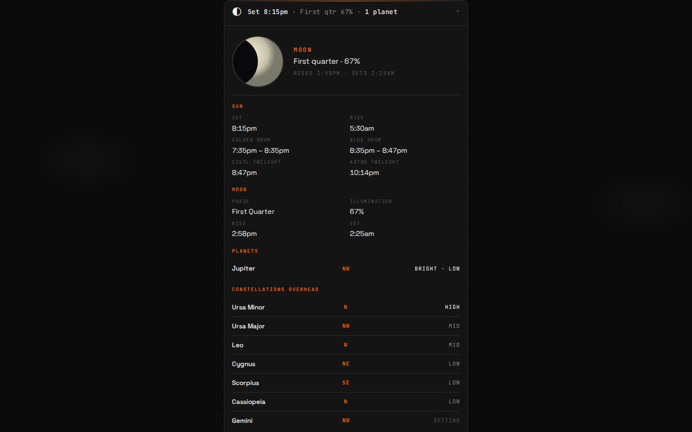
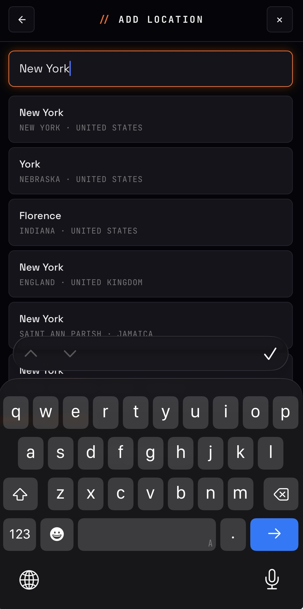
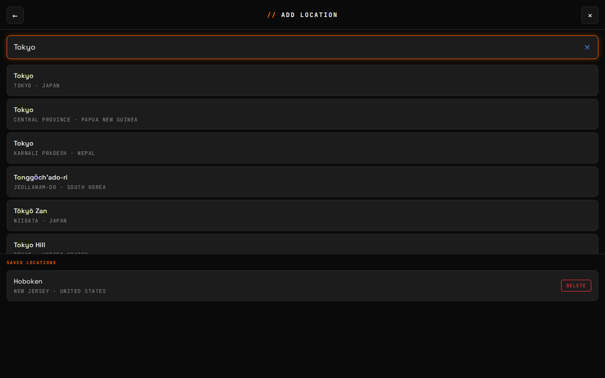
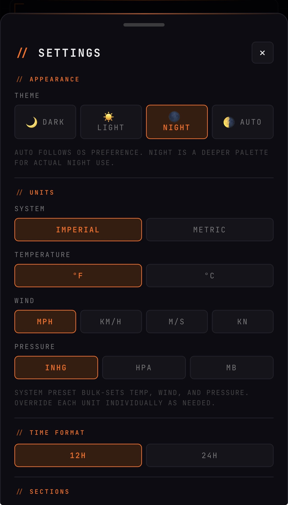
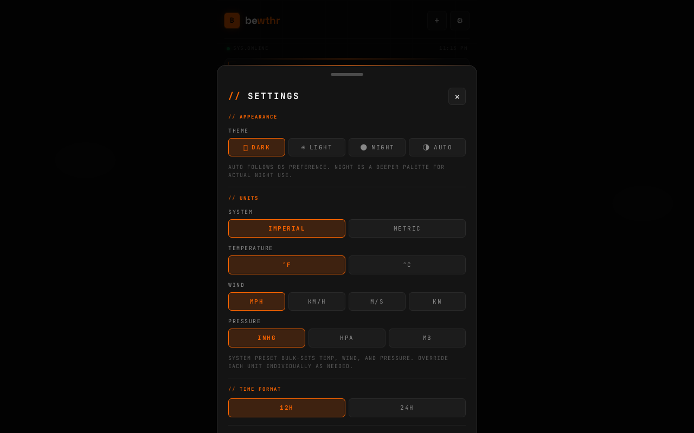

# bewthr

Local weather PWA.

Live: [codereimagine.github.io/bewthr](https://codereimagine.github.io/bewthr/)

## Screenshots

<table>
  <tr>
    <th>Mobile</th>
    <th>Desktop</th>
  </tr>
  <tr>
    <td></td>
    <td></td>
  </tr>
  <tr>
    <td colspan="2"><sub>Current conditions, metrics, saved places, hourly strip, 7-day forecast.</sub></td>
  </tr>
  <tr>
    <td></td>
    <td></td>
  </tr>
  <tr>
    <td colspan="2"><sub>Sky Tonight panel — sun, moon, planets, constellations overhead, all computed in-browser.</sub></td>
  </tr>
  <tr>
    <td></td>
    <td></td>
  </tr>
  <tr>
    <td colspan="2"><sub>Search any city worldwide and manage saved locations.</sub></td>
  </tr>
  <tr>
    <td></td>
    <td></td>
  </tr>
  <tr>
    <td colspan="2"><sub>Theme, units, time format, section toggles, animation level, refresh interval.</sub></td>
  </tr>
</table>

> Screenshots in `docs/screenshots/` are produced by `node scripts/capture-screenshots.mjs` against `npm run preview`. Re-run after UI changes.

## What it does

- Current conditions, hourly forecast, daily forecast, and active alerts.
- Saved places (search any city worldwide) with offline-cached results.
- "Sky Tonight" panel: sun, moon, planets, constellations overhead — all
  computed locally from your coordinates.
- Atmospheric overlay reacts to weather code and time of day: stars at
  night, drifting clouds, rain, snow.
- Settings: theme, units (imperial / metric), time format, section
  toggles, animation level (off / reduced / on with OS reduce-motion
  clamp), refresh interval.
- Installable to home screen; works offline once cached.

## Data sources

- Weather + geocoding: [Open-Meteo](https://open-meteo.com) (no key
  required).
- US alerts: [NWS API](https://www.weather.gov/documentation/services-web-api)
  (no key required, US-only coverage).
- Sky calculations: [astronomy-engine](https://github.com/cosinekitty/astronomy)
  (runs in-browser, no network).

## Stack

React 19 · Vite 8 · TypeScript · Tailwind 4 · Zustand (persist) ·
vite-plugin-pwa (Workbox) · idb-keyval.

## Develop

```sh
npm install
npm run dev      # http://localhost:5173
npm run lint
npm run build    # tsc -b && vite build
npm run preview  # serve the production bundle
```

### Dev override

Append `?atmo=stars|cloud|rain|snow|storm|all` to the dev URL to force
a specific atmosphere effect. Tree-shaken from production builds.

## Project layout

```
src/
  components/
    atmosphere/    # particle layers (stars, clouds, rain, snow)
    Sky*           # sun / moon / planets / constellations panels
    Settings*      # settings UI
    Modal.tsx      # shared modal shell
  hooks/           # useWeather, useSky, useGeolocation, useAnimationMode
  lib/             # openMeteo, nws, geocode, astronomy, skyFormat
  store/           # zustand stores (settings, places)
bewthr-docs/       # design previews (visual lock before any code)
```

## License

Apache License 2.0 — see [LICENSE](./LICENSE).
