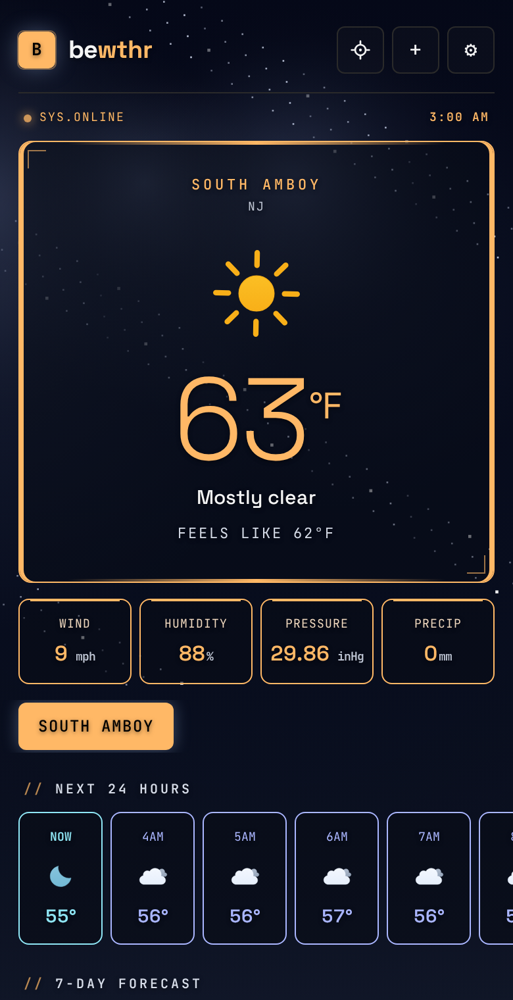
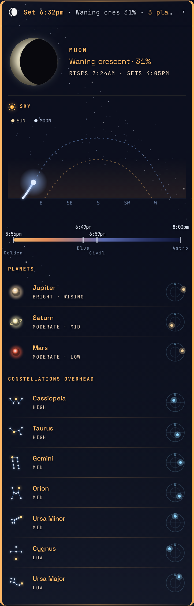
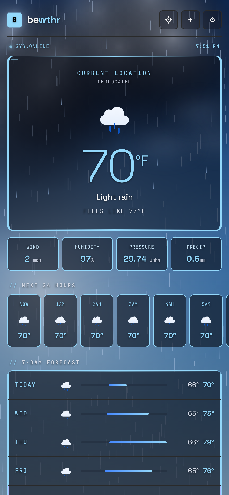
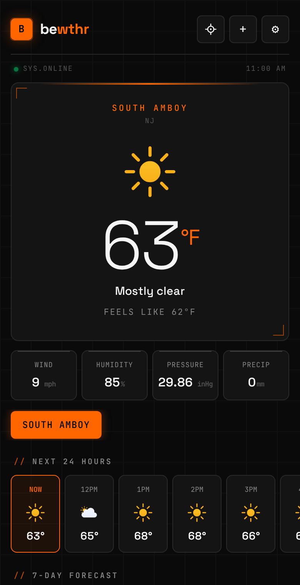
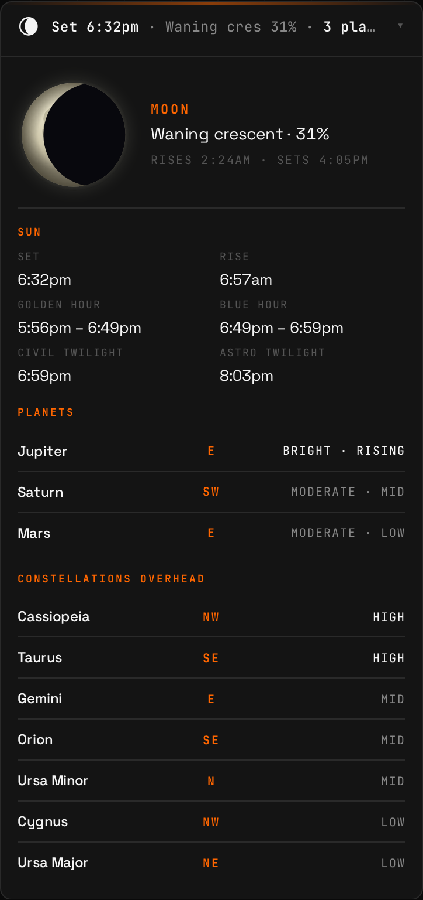

<div align="center">

# bewthr

### A living, astronomically-accurate weather app — private by design.

**▶ Live — [codereimagine.github.io/bewthr](https://codereimagine.github.io/bewthr/)**

*Two modes: **Imagined** — the full living sky · **Classic** — a clean, minimal instrument view. One tap to switch.*

<sub><b>IMAGINED</b> — the full living sky</sub>
<p>
  
  
  
</p>

<sub><b>CLASSIC</b> — a clean, minimal instrument view</sub>
<p>
  
  
</p>

</div>

---

bewthr shows the weather as a **living sky** rendered from real astronomy for your exact place and time — the sky brightens and darkens with the sun, the moon shows its true phase, rain and clouds move overhead — with the instrument chrome of a proper dashboard on top. It's fast, it's a PWA, and your location never leaves your device.

## What makes it bewthr

- **A live, accurate sky.** The background is computed, not a stock image — sun altitude sets the colour of the sky, the moon renders at its real phase, stars appear only when it's truly dark, and precipitation reflects the current conditions for *your* coordinates.
- **Sky Tonight — the signature.** A real astronomy instrument: the **sun and moon ride their exact rise → set paths** across a sky-dome, drawn from their true altitude *and* azimuth — so the two trails genuinely differ, just like the real sky. Plus a **dusk gradient timeline** for golden/blue-hour and twilight, the live moon phase with illumination, and the **planets & constellations overhead** — each with a mini **sky-position dial** showing its real direction and altitude.
- **Private by design.** Your precise coordinates stay **on your device**; only coarse, rounded coordinates are ever sent to fetch weather. Location is a single on/off switch — turn it off and nothing is acquired or sent.
- **Ad-free, tracker-free, open source.** No accounts, no analytics, no ads. Just weather.
- **Accessible.** WCAG-audited contrast over the animated sky, dark / light / night / auto themes, reduced-motion support.
- **Two moods.** *Imagined* mode is the full living sky; *Classic* is a clean, minimal instrument view. One tap to switch.

## How it works

- **Keyless weather** — Open-Meteo with a MET.no fallback, plus NWS alerts. No API keys.
- **Astronomy** — sun/moon/planet/constellation positions computed locally with [`astronomy-engine`](https://github.com/cosinekitty/astronomy).
- **Privacy** — precise location lives in on-device storage; egress is rounded (≈1 km "surrounding" by default, selectable down to ≈11 km "general", or exact). If browser GPS is blocked, it falls back to approximate network location — still no prompt required.
- **Rendering** — the sky is a layered HTML canvas: a static, compositor-cached sky layer with a lightweight animated precipitation layer on top, for smooth scrolling and battery-friendly motion.

## Tech

React 19 · TypeScript · Vite · Canvas 2D · `astronomy-engine` · Zustand · vite-plugin-pwa

## Run it locally

```bash
git clone https://github.com/codereimagine/bewthr.git
cd bewthr
npm install
npm run dev        # local dev server
npm run build      # production build → dist/
npm run preview    # preview the production build
npm test           # unit tests
```

## Credits

Built with [Claude Code](https://claude.com/claude-code).

## License

Apache-2.0 — see [LICENSE](LICENSE).
